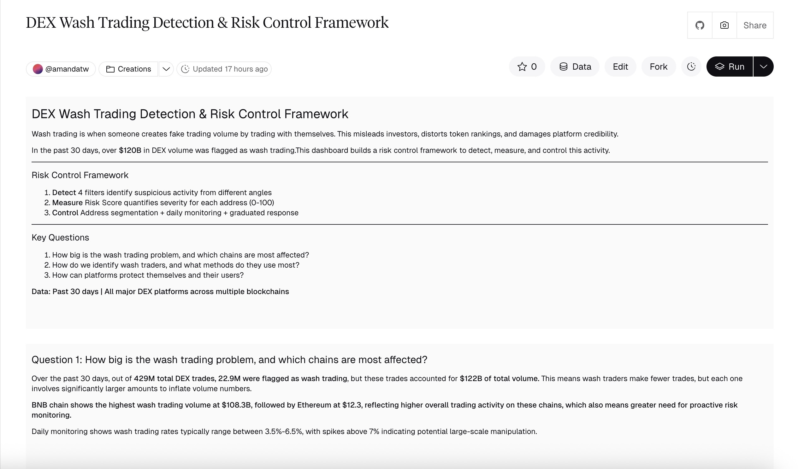
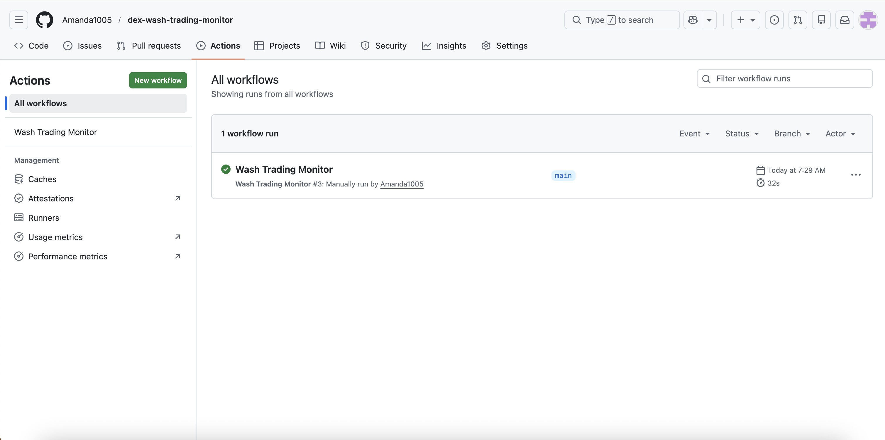
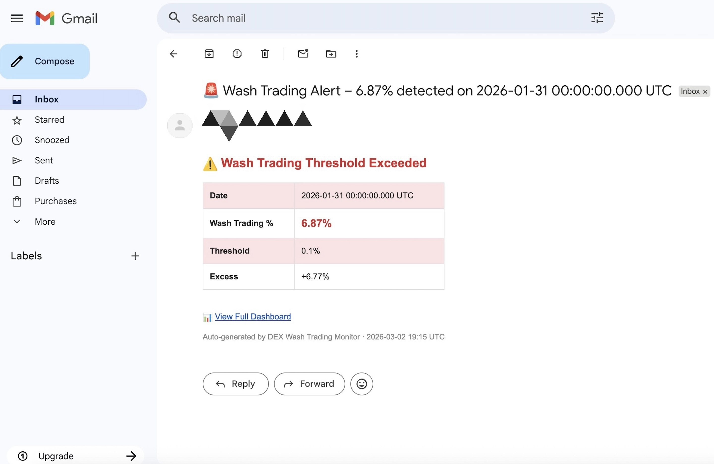

# DEX Wash Trading Monitor 🔍

> Automated monitoring system that fetches daily wash trading data from Dune Analytics and sends an email alert when the rate exceeds the 7% threshold.

Part of the [DEX Wash Trading Detection & Risk Control Framework](https://dune.com/amandatw/dex-wash-trading-detection-and-risk-control-framework), a full-stack risk control project built with SQL (Dune) + Python (automated monitoring).

---

##What is this?
Wash trading inflates DEX volume metrics, distorts token visibility, and undermines platform integrity. Over the past 30 days, $122B in DEX volume was flagged as suspicious, representing a material risk to data-driven decision making.

This monitor:
- Pulls daily wash trading % from a Dune Analytics query via REST API
- Compares it against a configurable threshold (default: 7%)
- Automatically sends an HTML email alert when the threshold is exceeded
- Runs every day at 09:00 UTC via GitHub Actions, no manual intervention needed

## Notes on Design Decisions

Why Email (not real-time)?
Wash trading is a statistical anomaly detected over time, not a millisecond-level event. Daily email digest is appropriate for risk reporting workflows and aligns with standard risk operations practice. The system can be extended to Slack or PagerDuty for real-time ops alerting.
 
---

## Architecture

```
Dune Analytics (S5 Daily Monitoring Query)
        ↓  REST API  — triggered daily at 09:00 UTC
   monitor.py  ←  GitHub Actions (cron schedule)
        ↓  if wash_trading_pct > 7%
   Email Alert (Gmail SMTP)
```

---

## Demo

### 📊 Dune Dashboard — Data Source


### ✅ GitHub Actions — Automated Daily Run


### 🚨 Email Alert — Threshold Exceeded


---

## Features

| Feature | Detail |
|---|---|
| Data source | Dune Analytics API v1 |
| Detection threshold | 7% (configurable) |
| Schedule | Daily at 09:00 UTC via GitHub Actions |
| Alert channel | Email (Gmail SMTP) |
| Manual trigger | GitHub Actions → Run workflow |

---

## Quick Start

```bash
# 1. Clone the repo
git clone https://github.com/Amanda1005/dex-wash-trading-monitor.git
cd dex-wash-trading-monitor

# 2. Install dependency
pip install requests

# 3. Set environment variables
export DUNE_API_KEY="your_dune_api_key"
export DUNE_QUERY_ID="your_query_id"
export SMTP_USER="your_gmail@gmail.com"
export SMTP_PASSWORD="your_gmail_app_password"
export ALERT_TO="recipient@email.com"

# 4. Run
python3 monitor.py
```

---

## Setup — GitHub Actions (Automated)

Go to your repo → **Settings → Secrets and variables → Actions → New repository secret**

| Secret | Value |
|---|---|
| `DUNE_API_KEY` | Dune Analytics API key |
| `DUNE_QUERY_ID` | S5 query ID (numbers only) |
| `SMTP_USER` | Sender Gmail address |
| `SMTP_PASSWORD` | Gmail App Password (16 chars) |
| `ALERT_TO` | Recipient email address |

> Gmail App Password: Google Account → Security → 2-Step Verification → App Passwords

Once secrets are set, the workflow runs automatically every day. You can also trigger it manually via **Actions → Wash Trading Monitor → Run workflow**.

---

## Tech Stack

| Layer | Tool |
|---|---|
| Data & SQL | Dune Analytics |
| API | Dune REST API v1 |
| Language | Python 3.11 |
| HTTP client | `requests` |
| Email | `smtplib` (Gmail SMTP) |
| Scheduling | GitHub Actions (cron) |

---

## Related

- 📊 [Dune Dashboard — Full Risk Control Framework](https://dune.com/amandatw/dex-wash-trading-detection-and-risk-control-framework)
